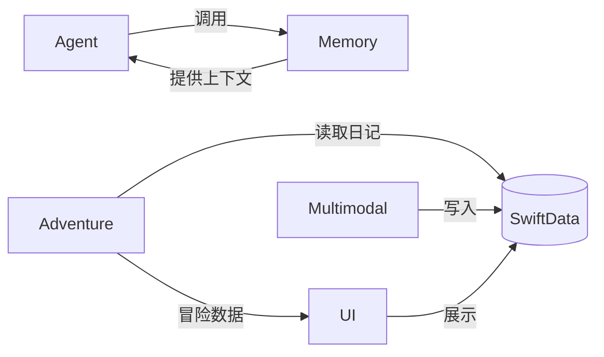

# Echo PRD — 团队并行任务分配

> **产品定位**：用最轻松的方式记录生活，然后看着 Echo 因为你的记录而成长冒险。
> **技术栈**：iOS 26+ · SwiftUI · SwiftData · Kimi-K2.5 API · NLEmbedding

---

## 当前进度

| 模块         | 状态       | 关键文件                                                                |
| ------------ | ---------- | ----------------------------------------------------------------------- |
| 📝 对话式日记 | ✅ 基础完成 | `ConversationalJournalView.swift`, `AIConversationService.swift`        |
| 📊 复盘分析   | ✅ 基础完成 | `ReviewView.swift`, `MoodTrendChart.swift`, `WeeklyReviewService.swift` |
| 🌲 Echo 冒险  | ⬜ 待建设   | `AdventureView.swift`(框架), `PetView.swift`(企鹅角色)                  |
| 💾 记忆系统   | ✅ Phase 1  | `MemoryManager.swift`, `VectorStore.swift`, `FactExtractor.swift`       |
| 🎨 UI 统一    | ⬜ 待打磨   | `JournalColors`, `JournalFonts`, `scrapbookStyle()`                     |

---

## 任务分配总览

| 任务                 | 负责人 | 核心交付物       | 预估工时 |
| -------------------- | ------ | ---------------- | -------- |
| **A — Agent**        | 队友 A | 对话 AI 服务增强 | 2-3 天   |
| **B — 幻觉（冒险）** | 队友 B | 文生图冒险系统   | 3-4 天   |
| **C — 多模态输入**   | 队友 C | 语音/拍照日记    | 2-3 天   |
| **D — UI**           | 队友 D | 全局视觉打磨     | 2-3 天   |
| **E — 长期记忆**     | 登登   | 记忆系统增强     | 3-4 天   |

---

## 任务 A：Agent（对话 AI 增强）

### 背景

当前 `AIConversationService.swift` 提供基础对话能力，但 prompt 较简单，没有结构化引导和多轮策略。

### 需求

1. **多轮引导策略**：设计 3-5 轮对话模板，Echo 从 "今天怎么样" → 追问细节 → 情绪探索 → 总结回顾
2. **上下文注入增强**：调用 `MemoryManager` 的检索结果，注入到 system prompt，让 Echo 能引用历史日记
3. **对话质量控制**：每次回复 1-2 句话，避免长篇大论；提问要具体不空泛
4. **情绪识别**：从用户消息中识别情绪线索，调整 Echo 的回应风格（安慰/鼓励/共情）
5. **对话结束判断**：自动检测用户是否聊够了（如连续短回复），温柔提示生成日记

### 关键文件

| 文件                          | 说明                                     |
| ----------------------------- | ---------------------------------------- |
| `AIConversationService.swift` | **主要修改** — system prompt、多轮策略   |
| `MemoryManager.swift`         | 调用其 `retrieveRelevantMemories()` 方法 |
| `JournalSummaryService.swift` | 优化日记总结 prompt                      |

### API 配置

```swift
// 见 APIConfig.swift
let apiEndpoint = "https://api.siliconflow.cn/v1/chat/completions"
let modelId = "moonshotai/Kimi-K2.5"
```

### 验收标准

- [ ] Echo 能在 3-5 轮对话中自然展开用户的一天
- [ ] 当记忆系统有历史数据时，Echo 能自然引用（如"上次你提到…"）
- [ ] 回复简短自然，像朋友聊天
- [ ] 对话结束时能自动提示生成日记

---

## 任务 B：幻觉（Echo 冒险 × 文生图）

### 背景

Echo 冒险是产品的核心情感绑定机制。不使用手写 SwiftUI 动画，改用**文生图 API** 生成冒险插画，降低开发成本且效果更好。

### 需求

1. **冒险叙事生成**
   - 输入：当天日记内容
   - LLM 提取关键词 + 情绪 → 转化为冒险元素
   - 输出：Echo 视角的冒险故事（50-100 字中文）
   - 示例：日记写了"今天加班很累" → "Echo 在暮光森林迷了路，又累又饿，但看到远处的篝火后重新打起了精神 🔥"

2. **文生图**
   - 从冒险叙事生成英文图片 prompt
   - 调用文生图 API 生成插画（统一水彩/手绘风格，匹配 app 手帐风）
   - 图片缓存到本地，避免重复生成

3. **绘本 UI**
   - 展示为"Echo 的冒险日记"：一张大图 + 一段文字
   - 左右滑动浏览不同天的冒险
   - 入口在 Tab 1 (Echo) 宠物主页

4. **物品收集（可选）**
   - 冒险中随机获得物品（emoji 表示）
   - 展示在宠物主页的收集栏

### 关键文件

| 文件                    | 说明                |
| ----------------------- | ------------------- |
| `AdventureView.swift`   | 改造为绘本阅读器    |
| `PetHomeView.swift`     | 冒险入口            |
| `PetStateManager.swift` | 已有能量/好感度系统 |

### 需新建文件

| 文件                           | 说明                          |
| ------------------------------ | ----------------------------- |
| `AdventureStoryService.swift`  | 日记 → 冒险叙事 + 图片 prompt |
| `ImageGenerationService.swift` | 文生图 API 调用 + 本地缓存    |
| `AdventureBookView.swift`      | 绘本翻页 UI                   |

### 文生图 API 建议

SiliconFlow 平台（和现有 chat API 同平台）支持图片生成：
```
POST https://api.siliconflow.cn/v1/images/generations
{
  "model": "stabilityai/stable-diffusion-3-5-large",
  "prompt": "A cute penguin exploring a magical watercolor forest...",
  "image_size": "1024x1024",
  "num_inference_steps": 30
}
```

### Prompt 模板参考

```
Style: soft watercolor illustration, children's book style, warm pastel colors, 
hand-drawn feel, whimsical, cozy atmosphere, no text.
Subject: A small cute penguin [冒险动作描述]
Setting: [场景描述]
```

### 验收标准

- [ ] 每天自动从日记生成一段冒险故事
- [ ] 文生图生成匹配故事内容的差异化插画
- [ ] 绘本 UI 可翻页浏览历史冒险
- [ ] 图片风格统一为水彩手绘风

---

## 任务 C：多模态输入

### 背景

`ConversationalJournalView` 已有 4 个模式 tab（AI引导/自由写/语音/拍照），但语音和拍照功能不完整。

### 需求

1. **语音输入增强**
   - 当前：语音通过 Sheet 录制后填充到文本框
   - 目标：直接在对话中按住录音，松手发送（类微信语音）
   - 使用已有的 `SpeechRecognitionService.swift`
   - 录音气泡显示：🎤 波形动画 + 转文字结果

2. **拍照模式**
   - 拍照 / 从相册选照片 → AI 识别照片内容 → Echo 基于照片引导对话
   - 照片展示在对话气泡中
   - 保存时照片附加到 `JournalEntry.photos`
   - 需要调用 vision API 做图片描述（可用 Kimi 的 multimodal endpoint）

3. **对话中插图**
   - 在 AI 引导模式下也能发送照片（inputBar 加一个 📎 按钮）
   - 类似 iMessage 的发图体验

### 关键文件

| 文件                              | 说明                              |
| --------------------------------- | --------------------------------- |
| `ConversationalJournalView.swift` | **主要修改** — inputBar、拍照模式 |
| `SpeechRecognitionService.swift`  | 已有语音识别逻辑                  |
| `VoiceRecorderView.swift`         | 可复用的录音 UI                   |
| `JournalEntry.swift`              | `photos: [MediaAttachment]`       |

### 隐私权限（已配置）

`project.pbxproj` 已添加：
- `NSMicrophoneUsageDescription` ✅
- `NSSpeechRecognitionUsageDescription` ✅
- `NSCameraUsageDescription` ✅
- `NSPhotoLibraryUsageDescription` ✅

### 验收标准

- [ ] 语音：按住录音松手发送，对话中显示转文字结果
- [ ] 拍照：拍照/选照后 AI 识别内容并引导对话
- [ ] 对话中可插入照片，保存时附加到日记

---

## 任务 D：UI 视觉统一与打磨

### 背景

App 使用手帐/剪贴簿风格（`scrapbookStyle()`），但各页面一致性不高，需要统一打磨。

### 需求

1. **设计系统完善**
   - 统一 `JournalColors`、`JournalFonts` 的使用
   - 确保所有卡片使用 `scrapbookStyle()` 修饰符
   - 纸质背景 `PaperTexture()` 全局使用

2. **Home 页改造**
   - 当前 Home 页内容较空（greeting + 日历 + mood card + practices）
   - 增加：今日冒险预览（来自任务 B）、最近日记摘要、Echo 状态卡片
   - 让 Home 页成为用户看到的第一个"Wow"

3. **History 页增强**
   - 当前是简单列表
   - 改为时间线布局：日期分组 + 心情 emoji 标记 + 日记摘要预览
   - 点击展开查看全文

4. **动效打磨**
   - 页面转场动画
   - 卡片出现的渐入动画
   - Tab 切换动效
   - 按钮的微交互（haptic feedback）

5. **深色模式适配**（如有余力）

### 关键文件

| 文件                | 说明                             |
| ------------------- | -------------------------------- |
| `Views/Scrapbook/`  | 设计系统（颜色/字体/样式修饰符） |
| `HomeView.swift`    | Home 页改造                      |
| `HistoryView.swift` | History 页增强                   |
| `ReviewView.swift`  | 确保风格一致                     |

### 设计系统 Token

```swift
// 颜色
JournalColors.inkBlack        // 主文字
JournalColors.warmGray        // 次要文字
JournalColors.warmWhite       // 卡片背景
JournalColors.softPink        // 强调色
JournalColors.lavender        // 辅助色
JournalColors.mintGreen       // 成功/积极
JournalColors.peach           // 警告/日程

// 字体
JournalFonts.largeTitle       // 页面标题
JournalFonts.headline         // 区块标题
JournalFonts.body             // 正文
JournalFonts.caption          // 注释

// 样式
.scrapbookStyle()             // 卡片圆角 + 阴影
.withWashiTape(color:)        // 纸胶带装饰
PaperTexture()                // 纸质纹理背景
```

### 验收标准

- [ ] 所有页面风格统一，视觉一致
- [ ] Home 页信息丰富，首屏效果惊艳
- [ ] History 页时间线布局清晰
- [ ] 页面转场和微交互动画流畅

---

## 任务 E：长期记忆增强（登登）

### 现有基础

已完成 Phase 1：事实提取 + 向量存储 + 用户档案。需要增强准确性和应用深度。

### 待做

- 记忆检索准确性优化（语义搜索 + 关键词混合排序）
- 记忆过期/衰减机制
- 记忆在复盘分析中的应用（历史对比、成长轨迹）
- 确保与任务 A(Agent) 的对接：提供统一的 `retrieveContext(for:)` 接口

---

## 协作约定

### 代码规范

- 所有新 View 使用 `PaperTexture()` 背景 + `scrapbookStyle()` 卡片
- 颜色/字体统一使用 `JournalColors` / `JournalFonts`
- Service 使用 `@Observable @MainActor final class` + `static let shared` 单例
- API 调用参考 `APIConfig.swift` 配置

### 分支策略

```
main
 ├── feature/agent          (队友 A)
 ├── feature/adventure      (队友 B)
 ├── feature/multimodal     (队友 C)
 ├── feature/ui-polish      (队友 D)
 └── feature/memory         (登登)
```

### 接口依赖



> **关键依赖**：任务 A 依赖任务 E 的记忆检索接口。登登应优先完成 `retrieveContext(for:)` 的稳定 API，让队友 A 可以并行开发。
